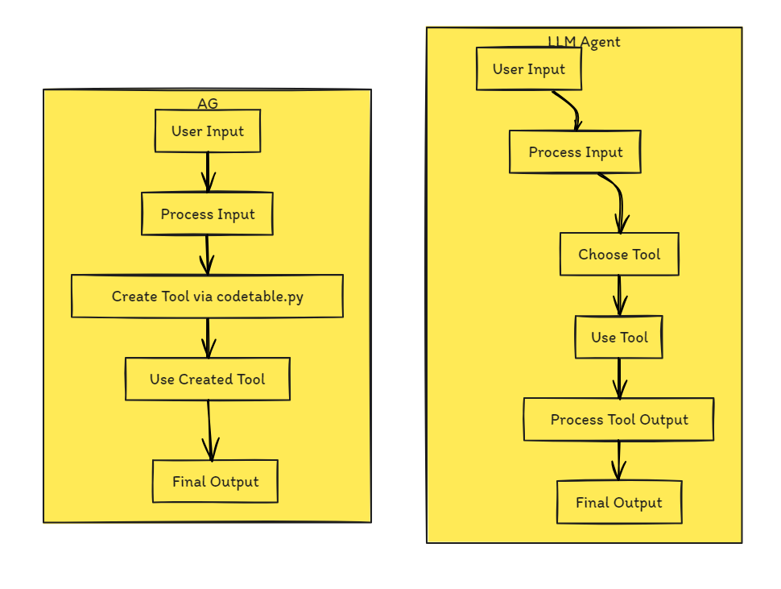

# AG Project

The AG project is an AI-driven assistant designed to interact with a user's computer through both text and visual inputs. It leverages a GUI for interaction, processes screenshots for commands, and executes tasks via Python scripts.

## Overview

This project integrates various technologies to create a versatile tool capable of performing a wide range of computer tasks based on user commands. It uses a chat interface for input and feedback, screenshot analysis for visual commands, and Python script execution for task automation.




## Getting Started

To use this project, clone the repository and install the required Python packages then adjust the directories/OpenAI api key:

```bash
git clone <repository-url>
cd AG-Project
pip install -r requirements.txt
```

### Change directories/api key
- In codetable.py : 
Directory for the virtual environment :
venv_dir = "AG\\temp_pipinstalls"
- In llm.py : 
Placeholder for OpenAI API Key :
OPENAI_API_KEY = "Your-API-Key-Here"
- In main.py :
Change 2 of :
screenshot_path = r"current_screen\current_screen.png"

### Run the main application
python src/main.py

## Features

### Chat Interface
- A graphical user interface (GUI) allows users to send commands and receive responses.
- Displays a history of interactions for reference.

### Screenshot Processing
- Users can provide screenshots for the AI to analyze.
- The application identifies text and UI elements within the screenshots, using their coordinates for task execution.

### Task Execution
- The assistant evaluates the user's request to determine the required actions.
- Executes tasks through Python scripts, which may involve opening applications, web browsing, document editing, and more.

### Code Execution
- Capable of running Python code to automate tasks on the user's computer.
- Supports the installation of Python packages as needed for task completion.

### Update and Feedback Loop
- Summarizes actions taken in response to commands.
- Explains the rationale behind the executed steps.

## Components

### Main Application (main.py)
- Manages the user interface and threading for non-blocking operations.
- Integrates with `llm.py` for processing user requests and executing tasks.

### Image Processing and Query Module (llm.py)
- Handles image encoding and text extraction from screenshots using EasyOCR.
- Builds prompts for the GPT model and processes responses.
- Manages API calls to OpenAI's GPT-4 Vision model.

### Code Execution Module (codetable.py)
- Executes Python code provided by the assistant.
- Manages a virtual environment for package installations and code execution.
- Provides a secondary GUI for direct code input and execution (if used in standalone mode).

## Technology Stack
- **Python**: Primary programming language.
- **Tkinter**: For GUI creation.
- **PyAutoGUI**: For GUI automation tasks like clicking and typing.
- **EasyOCR**: For text detection in images/screenshots.
- **OpenAI's GPT-4 Vision Model**: For processing complex tasks and generating code.
- **Subprocess**: For executing shell commands and Python scripts.
- **Requests**: For making API calls.

## Workflow
1. User inputs a request via the chat interface.
2. If a screenshot is provided, the assistant updates the `text_list` with text elements and their coordinates.
3. The assistant sends the user's request and the `text_list` to the GPT model.
4. It receives the model's response, including any Python code to execute.
5. The assistant uses the `codetable.py` module to execute the code.
6. The GUI is updated with the response from the assistant and any actions taken.

## Preview Video
[](https://www.youtube.com/watch?v=Un6pbXhHo2U)


